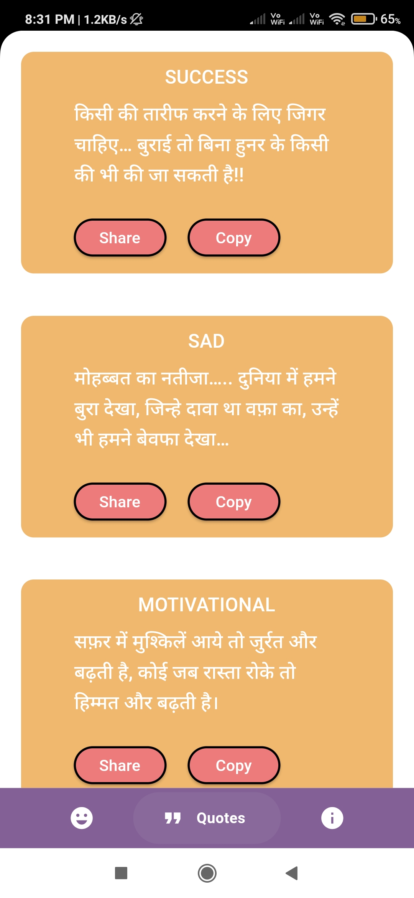
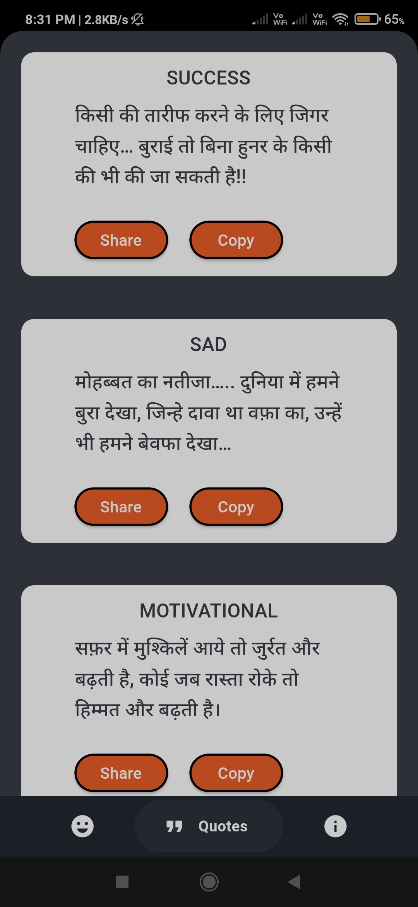

# SmileLines - Jokes and Quotes App

SmileLines is a Flutter app that brings you a collection of jokes and quotes to brighten your day. With a user-friendly interface and a variety of content, SmileLines is your go-to source for humor and inspiration.

## Features

- Browse a diverse collection of jokes and quotes.
- Swipe through content and enjoy a seamless experience.
- Easily switch between Jokes, Quotes, and Information pages.
- Pull down to refresh and load more content.
- Smooth animations and intuitive UI.
- Dark and Light Theme as per system theme for a personalized experience.

## Screenshots

### Light Mode

### Dark Mode

## Installation

1. Clone the repository: `git clone https://github.com/swarupkanade/SmileLines.git`
2. Navigate to the app's root directory: `cd smilelines`
3. Install dependencies: `flutter pub get`
4. Run the app: `flutter run`

## Dependencies

- Flutter
- HTTP requests
- GoogleNavBar

## Credits

- This app is inspired by the joy of sharing jokes and quotes.
- Special thanks to the Flutter community for their support.
- Also thanks to [Amit Sharma](https://github.com/amitSharma7741/Hindi_jokes_api) for providing the API service with its delightful content of jokes.

## Developed By

- Omkar Kanade [@omkarkanade](https://www.github.com/omkarkanade)
- Swarup Kanade [@swarupkanade](https://www.github.com/swarupkanade)

---

Feel free to contribute, suggest improvements, or report issues. Enjoy the app and spread the smiles!
